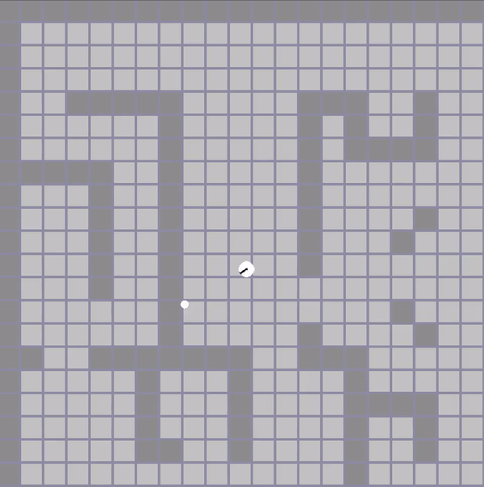

# Ray-cast

[](http://choosealicense.com/licenses/mit/)


## Simple ray cast visualization 

<p>
    
</p>

<b> Thanks <a href="https://github.com/Kofybrek">Kofybrek</a> for the textures </b>

# Requirements
* C++ 17
* CMake 3.20
* SFML 2.5

# Building & Running
```
cmake -B cmake-build-debug -DCMAKE_BUILD_TYPE=Debug
cmake --build cmake-build-debug
cmake --build cmake-build-debug --target debug
```

# Control
| Action               | Control         |
| ---------------------|-----------------|
| Move                 | wasd keys       |
| Rotation             | mouse movement  |
| Exit                 | esc             |


